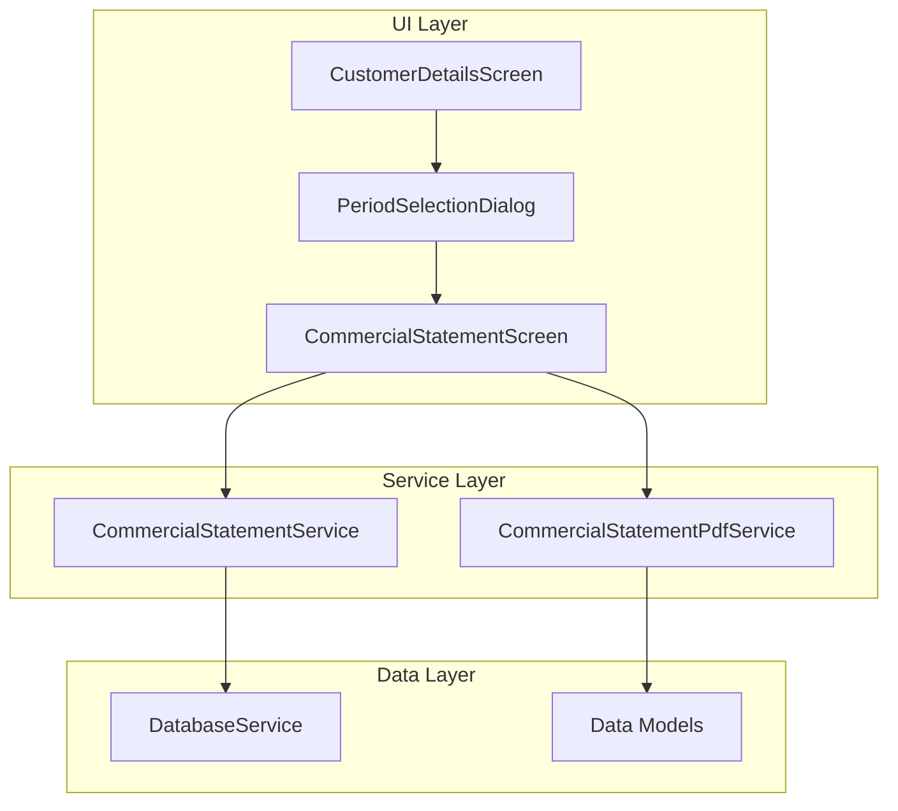

# Design Document: Commercial Account Statement

## Overview

كشف الحساب التجاري هو ميزة تُضاف إلى شاشة تفاصيل العميل لعرض ملخص مبسط للمعاملات المالية. الميزة الرئيسية هي تجميع كل المعاملات المرتبطة بنفس الفاتورة في سطر واحد، مما يوفر رؤية واضحة لصافي كل فاتورة بدلاً من عرض كل تعديل بشكل منفصل.

## Architecture



## Components and Interfaces

### 1. CommercialStatementService (lib/services/commercial_statement_service.dart)

خدمة منفصلة لمنطق كشف الحساب التجاري.

```dart
class CommercialStatementService {
  final DatabaseService _db;
  
  /// جلب كشف الحساب التجاري لعميل معين
  Future<CommercialStatementResult> getCommercialStatement({
    required int customerId,
    DateTime? startDate,
    DateTime? endDate,
  });
  
  /// تجميع المعاملات حسب الفاتورة
  List<CommercialStatementEntry> consolidateTransactions(
    List<DebtTransaction> transactions,
  );
  
  /// حساب الرصيد الافتتاحي لفترة معينة
  Future<double> calculateOpeningBalance({
    required int customerId,
    required DateTime periodStart,
  });
  
  /// حساب ملخص الإحصائيات
  StatementSummary calculateSummary(
    List<CommercialStatementEntry> entries,
    double openingBalance,
  );
  
  /// جلب السنوات المتاحة للعميل
  Future<List<int>> getAvailableYears(int customerId);
}
```

### 2. CommercialStatementPdfService (lib/services/commercial_statement_pdf_service.dart)

خدمة إنشاء PDF مبسط لكشف الحساب التجاري.

```dart
class CommercialStatementPdfService {
  /// إنشاء PDF لكشف الحساب التجاري
  Future<Uint8List> generatePdf({
    required Customer customer,
    required CommercialStatementResult statement,
    required String periodDescription,
  });
}
```

### 3. UI Components

#### PeriodSelectionDialog
حوار اختيار الفترة الزمنية.

#### CommercialStatementScreen
شاشة عرض كشف الحساب التجاري مع الإحصائيات والقائمة.

## Data Models

سيتم استخدام `Map<String, dynamic>` بدلاً من classes منفصلة لتبسيط الكود.

### CommercialStatementEntry (Map)

```dart
/// سطر واحد في كشف الحساب التجاري
Map<String, dynamic> entry = {
  'date': DateTime,           // تاريخ المعاملة
  'description': String,      // وصف المعاملة
  'netAmount': double,        // صافي المبلغ
  'runningBalance': double,   // الرصيد الجاري
  'type': String,             // 'opening_balance', 'consolidated_invoice', 'manual_transaction'
  'invoiceId': int?,          // رقم الفاتورة (null للمعاملات اليدوية)
  'originalTransactions': List<DebtTransaction>?, // المعاملات الأصلية للتفاصيل
  'originalAmount': double?,  // المبلغ الأصلي (للفواتير)
  'adjustments': double?,     // التعديلات (للفواتير)
  'payments': double?,        // المدفوعات (للفواتير)
};
```

### CommercialStatementResult (Map)

```dart
/// نتيجة كشف الحساب التجاري الكاملة
Map<String, dynamic> result = {
  'openingBalance': double,                    // الرصيد الافتتاحي
  'entries': List<Map<String, dynamic>>,       // قائمة السطور
  'summary': Map<String, dynamic>,             // الملخص
  'finalBalance': double,                      // الرصيد النهائي
};
```

### StatementSummary (Map)

```dart
/// ملخص إحصائيات الكشف
Map<String, dynamic> summary = {
  'totalInvoices': int,           // عدد الفواتير
  'totalInvoiceAmounts': double,  // إجمالي مبالغ الفواتير
  'totalPayments': double,        // إجمالي المدفوعات
  'remainingBalance': double,     // الرصيد المتبقي
};
```

## Correctness Properties

*A property is a characteristic or behavior that should hold true across all valid executions of a system-essentially, a formal statement about what the system should do. Properties serve as the bridge between human-readable specifications and machine-verifiable correctness guarantees.*

### Property 1: Transaction Consolidation Completeness
*For any* list of transactions with the same invoice_id, consolidating them SHALL produce exactly one entry with net amount equal to the sum of all amount_changed values.
**Validates: Requirements 3.1, 3.2**

### Property 2: Period Filtering Correctness
*For any* set of transactions and a selected period (year/month), the filtered result SHALL contain only transactions within that period.
**Validates: Requirements 2.3, 2.4**

### Property 3: Opening Balance Calculation
*For any* customer and period start date, the opening balance SHALL equal the sum of all amount_changed values for transactions before that date.
**Validates: Requirements 5.1**

### Property 4: Running Balance Consistency
*For any* list of statement entries, the running balance of entry N SHALL equal opening_balance plus the sum of net amounts from entries 1 to N.
**Validates: Requirements 8.1, 8.2**

### Property 5: Manual Transaction Separation
*For any* transaction with null invoice_id, it SHALL appear as a separate entry (not consolidated with any other transaction).
**Validates: Requirements 4.1**

### Property 6: Summary Calculation Correctness
*For any* list of statement entries, the summary totals SHALL correctly reflect: count of invoice entries, sum of positive amounts, sum of negative amounts, and final balance.
**Validates: Requirements 6.2**

### Property 7: Comprehensive Statement Includes All
*For any* customer selecting "كشف حساب شامل", the result SHALL include all transactions for that customer with opening balance of zero.
**Validates: Requirements 2.1, 5.2**

### Property 8: Balance Discrepancy Detection
*For any* statement where final running balance differs from customer's current_total_debt by more than 1, the system SHALL flag a warning.
**Validates: Requirements 8.3**

## Error Handling

| Error Scenario | Handling Strategy |
|----------------|-------------------|
| No transactions found | Display empty state with message "لا توجد معاملات في هذه الفترة" |
| Database error | Show error snackbar and log error |
| PDF generation failure | Show error dialog with retry option |
| Invalid date range | Prevent selection and show validation message |

## Testing Strategy

### Unit Tests
- Test consolidation logic with various transaction combinations
- Test opening balance calculation
- Test summary calculations
- Test period filtering

### Property-Based Tests
Using `fast_check` library for Dart:

1. **Property 1**: Generate random transactions with same invoice_id, verify consolidation produces correct net amount
2. **Property 2**: Generate random transactions across multiple dates, verify filtering returns only matching dates
3. **Property 3**: Generate random transaction history, verify opening balance calculation
4. **Property 4**: Generate random entries, verify running balance chain
5. **Property 5**: Generate transactions with null invoice_id, verify they appear separately
6. **Property 6**: Generate random entries, verify summary calculations
7. **Property 7**: Generate random transactions, verify comprehensive statement includes all
8. **Property 8**: Generate statements with balance discrepancies, verify warning is triggered

Each property test will run minimum 100 iterations.

